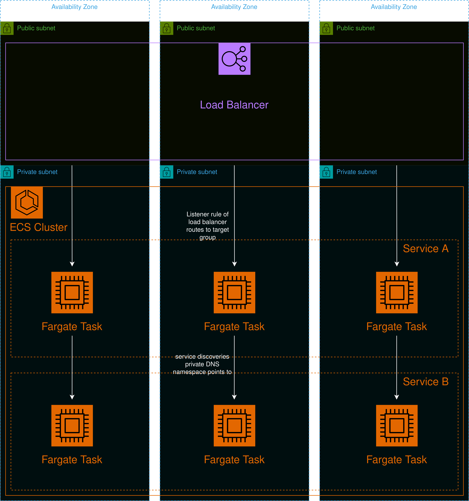

# Module: Cluster



This module provides an ECS cluster with Fargate tasks. The module only supports one service in the cluster and is intended to be used for a monolithic application architecture. The Fargate tasks are autoscaled and a load balancer distributes the traffic between the tasks.

## Contents

- [Requirements](#requirements)
- [Inputs](#inputs)
- [Outputs](#outputs)
- [Example](#example)
- [Contributing](#contributing)

## Requirements

| Name      | Version |
| --------- | ------- |
| terraform | >= 1.0  |
| aws       | >= 5.20 |

## Inputs

| Name               | Description                                                                 | Type           | Default | Required |
| ------------------ | --------------------------------------------------------------------------- | -------------- | ------- | :------: |
| identifier         | Unique identifier to differentiate global resources.                        | `string`       | n/a     |   yes    |
| policies           | List of IAM policy ARNs for the Fargate task's IAM role.                    | `list(string)` | []      |    no    |
| log_config         | Object to define logging configuration for the Fargate tasks to CloudWatch. | `object`       | n/a     |   yes    |
| image              | Object of the image which will be pulled by the Fargate tasks to execute.   | `object`       | null    |    no    |
| security_groups    | List of security group IDs the ECS service will hold.                       | `list(string)` | []      |    no    |
| network_config     | Object of definition for the network configuration of the ECS service.      | `object`       | n/a     |   yes    |
| env_variables      | A map of environment variables for the Fargate task at runtime.             | `map(string)`  | {}      |    no    |
| memory             | Amount of memory in MiB used by each Fargate tasks.                         | `number`       | 512     |    no    |
| cpu                | Number of CPU units used by each Fargate tasks.                             | `number`       | 256     |    no    |
| desired_task_count | Preferred number of task that shall run.                                    | `number`       | 1       |    no    |
| tags               | A map of tags to add to all resources.                                      | `map(string)`  | {}      |    no    |

### `log_config`

| Name              | Description                                                                                                                | Type     | Default | Required |
| ----------------- | -------------------------------------------------------------------------------------------------------------------------- | -------- | ------- | :------: |
| region            | Region in which the CloudWatch log group shall live.                                                                       | `string` | n/a     |   yes    |
| retention_in_days | Specifies the number of days the log events shall be retained. Valid values: 1, 3, 5, 7, 14, 30, 365 and 0 (never expire). | `number` | n/a     |   yes    |

### `image`

| Name | Description           | Type     | Default | Required |
| ---- | --------------------- | -------- | ------- | :------: |
| uri  | The URI to the image. | `string` | n/a     |   yes    |

### `network_config`

| Name    | Description                                                                               | Type           | Default | Required |
| ------- | ----------------------------------------------------------------------------------------- | -------------- | ------- | :------: |
| vpc     | The ID of the subnets' VPC.                                                               | `string`       | n/a     |   yes    |
| subnets | The ID of the subnet in which the Fargate tasks live in. (subnets must be located in VPC) | `list(string)` | n/a     |   yes    |

## Outputs

| Name           | Description                                      |
| -------------- | ------------------------------------------------ |
| ecr_repository | Object of the created ECR repository if created. |
| log_arn        | The ARN of the created CloudWatch log group.     |

### `ecr_repository`

| Name | Description                    |
| ---- | ------------------------------ |
| uri  | The URI of the ECR repository. |
| arn  | The ARN of the ECR repository. |

## Example

```hcl
module "cluster" {
  source = "github.com/custom-terraform-aws-modules/cluster"

  identifier         = "example-cluster-dev"
  memory             = 512
  cpu                = 256
  desired_task_count = 1
  security_groups    = ["sg-woht9328g23", "sg-3429yfwlefhwe"]
  policies = [
    "arn:aws:iam::aws:policy/aws-service-role/AccessAnalyzerServiceRolePolicy",
    "arn:aws:iam::aws:policy/AdministratorAccess-Amplify"
  ]

  image = {
    uri = "example.registry:latest"
  }

  env_variables = {
    EXAMPLE_VAR = "example123"
  }

  network_config = {
    vpc     = "vpc-01234567890abcdef"
    subnets = ["subnet-1242421", "subnet-2344898"]
  }

  log_config = {
    region            = "eu-central-1"
    retention_in_days = 7
  }

  tags = {
    Project     = "example-project"
    Environment = "dev"
  }
}
```

## Contributing

In order for a seamless CI workflow copy the `pre-commit` git hook from `.github/hooks` into your local `.git/hooks`. The hook formats the terraform code automatically before each commit.

```bash
cp ./.github/hooks/pre-commit ./.git/hooks/pre-commit
```
